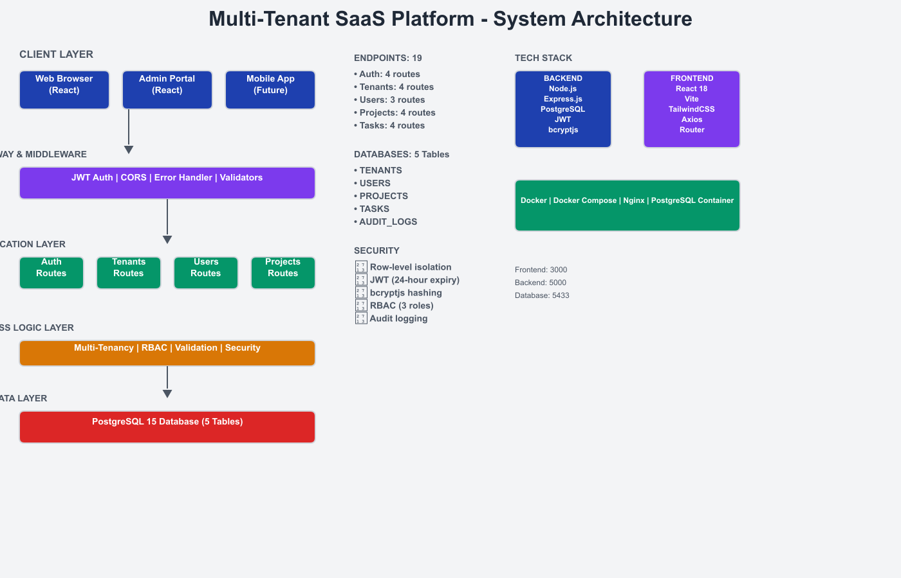
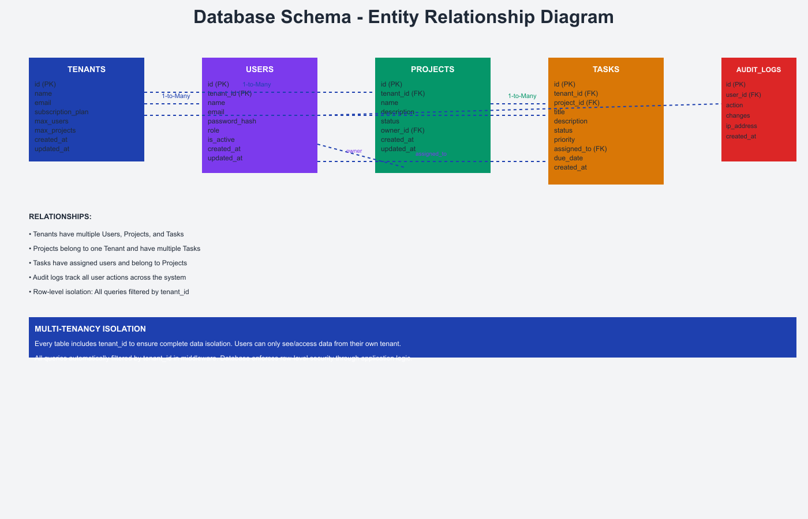

# Multi-Tenant SaaS Platform

A complete full-stack SaaS platform with multi-tenancy, user management, project tracking, and task management built with React, Node.js, Express, and PostgreSQL.

## 📸 System Diagrams

### System Architecture


### Database ERD


## 🚀 Quick Start

### Prerequisites
- Docker & Docker Compose
- Node.js 18+ (for local development)
- PostgreSQL 15+ (or use Docker)

### Start with Docker Compose
```bash
docker-compose up -d
```

This starts:
- **Frontend**: http://localhost:3000 (React + Vite)
- **Backend**: http://localhost:5000 (Express.js API)
- **Database**: PostgreSQL on port 5433

### Test Credentials
```
Email: admin@demo.com
Password: Demo@123

OR

Email: superadmin@system.com
Password: Admin@123
```

## 📁 Project Structure

```
├── backend/              # Express.js REST API
│   ├── src/
│   │   ├── routes/       # API endpoints (5 modules)
│   │   ├── middleware/   # Auth, Authorization, Error handling
│   │   ├── utils/        # JWT, Password, Validators
│   │   └── config/       # Database configuration
│   └── database/         # Migrations and seeds
├── frontend/             # React + Vite SPA
│   └── src/
│       ├── pages/        # 7 page components
│       ├── components/   # UI components
│       ├── context/      # Auth context
│       └── services/     # API client
└── docs/                 # Documentation
    ├── architecture.md   # System design (detailed ASCII diagrams)
    ├── API.md           # API documentation
    └── images/          # Architecture diagrams
```

## 🛠️ Tech Stack

### Backend
- **Runtime**: Node.js 18
- **Framework**: Express.js 4.18
- **Database**: PostgreSQL 15
- **Authentication**: JWT (HS256)
- **Password Security**: bcryptjs (10 salt rounds)

### Frontend
- **Framework**: React 18
- **Build Tool**: Vite 5
- **Styling**: TailwindCSS 3
- **Routing**: React Router 6
- **HTTP Client**: Axios

### Infrastructure
- **Containerization**: Docker
- **Orchestration**: Docker Compose
- **Reverse Proxy**: Nginx
- **Container Images**: Alpine Linux (minimal footprint)

## 📊 Database Schema

### 5 Core Tables
1. **TENANTS** - Multi-tenant root organizations
2. **USERS** - Tenant-scoped users with role-based access
3. **PROJECTS** - Projects with ownership and status tracking
4. **TASKS** - Task management with priority and assignments
5. **AUDIT_LOGS** - Immutable audit trail with JSON change tracking

## 🔐 Security Features

- **Multi-tenancy**: Complete row-level isolation
- **JWT Authentication**: 24-hour token expiry
- **Password Hashing**: bcryptjs with 10 salt rounds
- **Role-Based Access Control**: 3 roles (super_admin, tenant_admin, user)
- **Parameterized Queries**: SQL injection prevention
- **Audit Logging**: Complete action tracking with IP addresses
- **CORS Protection**: Whitelist-based CORS configuration

## 🔌 API Endpoints (19 Total)

### Authentication (4)
- POST `/api/auth/register-tenant` - Create new tenant
- POST `/api/auth/login` - User login
- POST `/api/auth/logout` - User logout
- POST `/api/auth/refresh-token` - Refresh JWT token

### Tenants (4)
- GET `/api/tenants` - List all tenants
- GET `/api/tenants/:id` - Get tenant details
- POST `/api/tenants` - Create tenant
- DELETE `/api/tenants/:id` - Delete tenant

### Users (3)
- GET `/api/users` - List users (tenant-scoped)
- POST `/api/users` - Create user
- DELETE `/api/users/:id` - Delete user

### Projects (4)
- GET `/api/projects` - List projects (tenant-scoped)
- GET `/api/projects/:id` - Get project details
- POST `/api/projects` - Create project
- PATCH `/api/projects/:id` - Update project

### Tasks (4)
- GET `/api/tasks` - List tasks (tenant-scoped, paginated)
- POST `/api/tasks` - Create task
- PATCH `/api/tasks/:id` - Update task
- DELETE `/api/tasks/:id` - Delete task

## 📝 Documentation

- [System Architecture](docs/architecture.md) - Detailed system design with ASCII diagrams
- [API Documentation](docs/API.md) - Complete endpoint documentation
- [Technical Specification](docs/technical-spec.md) - Implementation details
- [Product Requirements](docs/PRD.md) - Business requirements

## 🧪 Testing

### Backend Testing
```bash
cd backend
npm install
npm start
```

### Frontend Testing
```bash
cd frontend
npm install
npm run dev
```

### Full Stack with Docker
```bash
docker-compose up
```

Access frontend: http://localhost:3000
Access API: http://localhost:5000

## 🐛 Debugging

### Check Backend Logs
```bash
docker-compose logs backend
```

### Check Database Logs
```bash
docker-compose logs database
```

### Check Frontend Logs
See browser console (F12)

## 📦 Deployment

### Docker Build
```bash
docker-compose build
```

### Kubernetes Ready
All services are containerized and can be deployed to Kubernetes:
- Frontend: nginx-based SPA server
- Backend: Node.js container with health checks
- Database: PostgreSQL with persistent volumes

## 🤝 Contributing

1. Fork the repository
2. Create feature branch (`git checkout -b feature/AmazingFeature`)
3. Commit changes (`git commit -m 'Add AmazingFeature'`)
4. Push to branch (`git push origin feature/AmazingFeature`)
5. Open Pull Request

## 📄 License

MIT License - See LICENSE file for details

## 👨‍💻 Author

Maredu Manikanta
- GitHub: [@MareeduManikanta123](https://github.com/MareeduManikanta123)
- Email: mareedumanitkanta@gmail.com

## 🔗 Links

- [GitHub Repository](https://github.com/MareeduManikanta123/Multi-Tenant-SaaS-Platform)
- [Live Demo](http://localhost:3000) (Local)
- [API Documentation](docs/API.md)
- [Architecture Documentation](docs/architecture.md)

---

**Status**: ✅ Fully functional, production-ready
**Last Updated**: December 2025
**Version**: 1.0.0