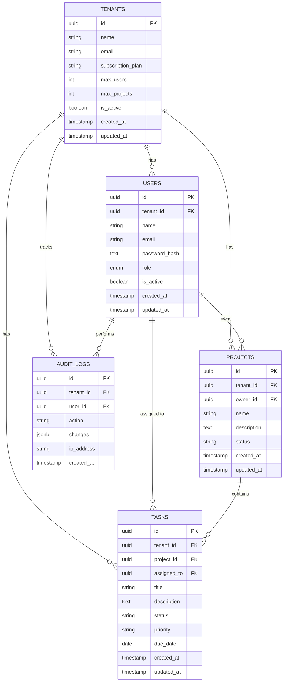
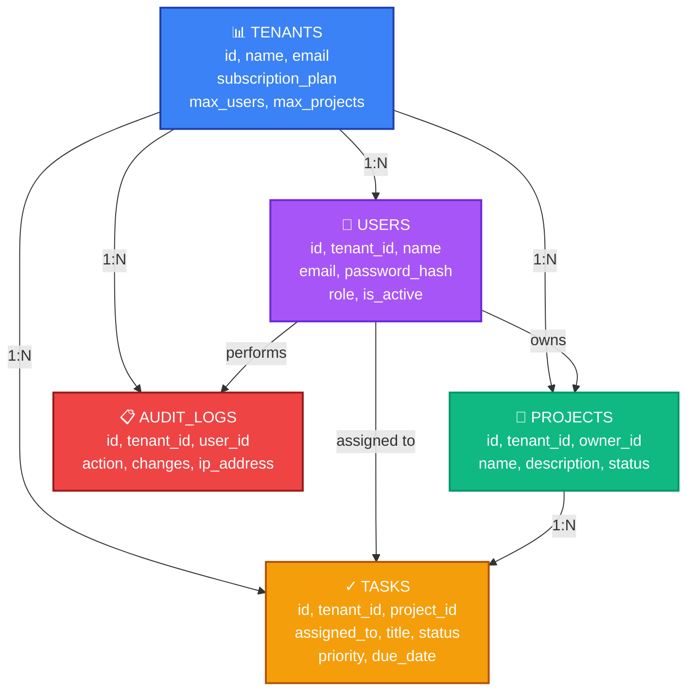

# Database ERD Diagram - Mermaid Code

Copy and paste this code into [mermaid.live](https://mermaid.live)

```mermaid
erDiagram
    TENANTS ||--o{ USERS : has
    TENANTS ||--o{ PROJECTS : has
    TENANTS ||--o{ TASKS : has
    TENANTS ||--o{ AUDIT_LOGS : tracks
    USERS ||--o{ PROJECTS : owns
    USERS ||--o{ TASKS : "assigned to"
    PROJECTS ||--o{ TASKS : contains
    USERS ||--o{ AUDIT_LOGS : performs
    
    TENANTS {
        uuid id PK
        string name
        string email
        string subscription_plan
        int max_users
        int max_projects
        boolean is_active
        timestamp created_at
        timestamp updated_at
    }
    
    USERS {
        uuid id PK
        uuid tenant_id FK
        string name
        string email
        text password_hash
        enum role
        boolean is_active
        timestamp created_at
        timestamp updated_at
    }
    
    PROJECTS {
        uuid id PK
        uuid tenant_id FK
        uuid owner_id FK
        string name
        text description
        string status
        timestamp created_at
        timestamp updated_at
    }
    
    TASKS {
        uuid id PK
        uuid tenant_id FK
        uuid project_id FK
        uuid assigned_to FK
        string title
        text description
        string status
        string priority
        date due_date
        timestamp created_at
        timestamp updated_at
    }
    
    AUDIT_LOGS {
        uuid id PK
        uuid tenant_id FK
        uuid user_id FK
        string action
        jsonb changes
        string ip_address
        timestamp created_at
    }
```

## Alternative: Graph Representation

```mermaid
graph TD
    T["📊 TENANTS<br/>id, name, email<br/>subscription_plan<br/>max_users, max_projects"]
    U["👥 USERS<br/>id, tenant_id, name<br/>email, password_hash<br/>role, is_active"]
    P["📁 PROJECTS<br/>id, tenant_id, owner_id<br/>name, description, status"]
    K["✓ TASKS<br/>id, tenant_id, project_id<br/>assigned_to, title, status<br/>priority, due_date"]
    A["📋 AUDIT_LOGS<br/>id, tenant_id, user_id<br/>action, changes, ip_address"]
    
    T -->|1:N| U
    T -->|1:N| P
    T -->|1:N| K
    T -->|1:N| A
    U -->|owns| P
    U -->|assigned to| K
    P -->|1:N| K
    U -->|performs| A
    
    style T fill:#3b82f6,stroke:#1e40af,stroke-width:2px,color:#fff
    style U fill:#a855f7,stroke:#6d28d9,stroke-width:2px,color:#fff
    style P fill:#10b981,stroke:#059669,stroke-width:2px,color:#fff
    style K fill:#f59e0b,stroke:#b45309,stroke-width:2px,color:#fff
    style A fill:#ef4444,stroke:#991b1b,stroke-width:2px,color:#fff
```
