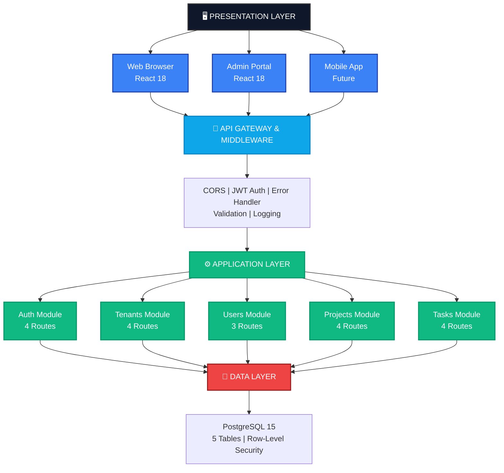
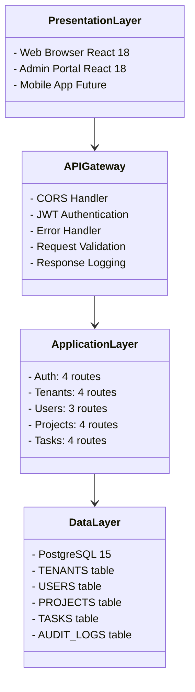

# System Architecture Diagram - Mermaid Code

Copy and paste this code into [mermaid.live](https://mermaid.live)

## Graph Diagram

```mermaid
graph TD
    A["🖥️ PRESENTATION LAYER"]
    A1["Web Browser<br/>React 18"]
    A2["Admin Portal<br/>React 18"]
    A3["Mobile App<br/>Future"]
    
    B["🔌 API GATEWAY & MIDDLEWARE"]
    B1["CORS | JWT Auth | Error Handler<br/>Validation | Logging"]
    
    C["⚙️ APPLICATION LAYER"]
    C1["Auth Module<br/>4 Routes"]
    C2["Tenants Module<br/>4 Routes"]
    C3["Users Module<br/>3 Routes"]
    C4["Projects Module<br/>4 Routes"]
    C5["Tasks Module<br/>4 Routes"]
    
    D["💾 DATA LAYER"]
    D1["PostgreSQL 15<br/>5 Tables | Row-Level Security"]
    
    A --> A1
    A --> A2
    A --> A3
    
    A1 --> B
    A2 --> B
    A3 --> B
    
    B --> B1
    
    B1 --> C
    
    C --> C1
    C --> C2
    C --> C3
    C --> C4
    C --> C5
    
    C1 --> D
    C2 --> D
    C3 --> D
    C4 --> D
    C5 --> D
    
    D --> D1
    
    style A fill:#0f172a,stroke:#333,stroke-width:2px,color:#fff
    style B fill:#0ea5e9,stroke:#0284c7,stroke-width:2px,color:#fff
    style C fill:#10b981,stroke:#059669,stroke-width:2px,color:#fff
    style D fill:#ef4444,stroke:#991b1b,stroke-width:2px,color:#fff
    style A1 fill:#3b82f6,stroke:#1e40af,stroke-width:2px,color:#fff
    style A2 fill:#3b82f6,stroke:#1e40af,stroke-width:2px,color:#fff
    style A3 fill:#3b82f6,stroke:#1e40af,stroke-width:2px,color:#fff
    style C1 fill:#10b981,stroke:#059669,stroke-width:2px,color:#fff
    style C2 fill:#10b981,stroke:#059669,stroke-width:2px,color:#fff
    style C3 fill:#10b981,stroke:#059669,stroke-width:2px,color:#fff
    style C4 fill:#10b981,stroke:#059669,stroke-width:2px,color:#fff
    style C5 fill:#10b981,stroke:#059669,stroke-width:2px,color:#fff
```

## Class Diagram

```mermaid
classDiagram
    class PresentationLayer {
        - Web Browser React 18
        - Admin Portal React 18
        - Mobile App Future
    }
    
    class APIGateway {
        - CORS Handler
        - JWT Authentication
        - Error Handler
        - Request Validation
        - Response Logging
    }
    
    class ApplicationLayer {
        - Auth: 4 routes
        - Tenants: 4 routes
        - Users: 3 routes
        - Projects: 4 routes
        - Tasks: 4 routes
    }
    
    class DataLayer {
        - PostgreSQL 15
        - TENANTS table
        - USERS table
        - PROJECTS table
        - TASKS table
        - AUDIT_LOGS table
    }
    
    PresentationLayer --> APIGateway
    APIGateway --> ApplicationLayer
    ApplicationLayer --> DataLayer
```
