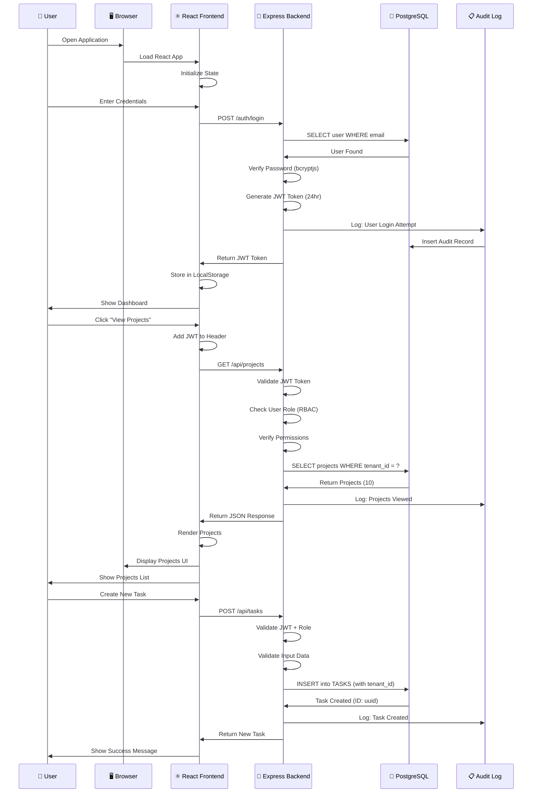
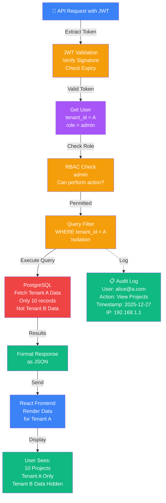

# System Data Flow Diagram - Mermaid Code

Copy and paste this code into [mermaid.live](https://mermaid.live)

```mermaid
sequenceDiagram
    participant User as 👤 User
    participant Browser as 🖥️ Browser
    participant Frontend as ⚛️ React Frontend
    participant Backend as 🔧 Express Backend
    participant DB as 💾 PostgreSQL
    participant Audit as 📋 Audit Log
    
    User->>Browser: Open Application
    Browser->>Frontend: Load React App
    Frontend->>Frontend: Initialize State
    
    User->>Frontend: Enter Credentials
    Frontend->>Backend: POST /auth/login
    Backend->>DB: SELECT user WHERE email
    DB->>Backend: User Found
    Backend->>Backend: Verify Password (bcryptjs)
    Backend->>Backend: Generate JWT Token (24hr)
    Backend->>Audit: Log: User Login Attempt
    Audit->>DB: Insert Audit Record
    Backend->>Frontend: Return JWT Token
    Frontend->>Frontend: Store in LocalStorage
    Frontend->>User: Show Dashboard
    
    User->>Frontend: Click "View Projects"
    Frontend->>Frontend: Add JWT to Header
    Frontend->>Backend: GET /api/projects
    Backend->>Backend: Validate JWT Token
    Backend->>Backend: Check User Role (RBAC)
    Backend->>Backend: Verify Permissions
    Backend->>DB: SELECT projects WHERE tenant_id = ?
    DB->>Backend: Return Projects (10)
    Backend->>Audit: Log: Projects Viewed
    Backend->>Frontend: Return JSON Response
    Frontend->>Frontend: Render Projects
    Frontend->>Browser: Display Projects UI
    Frontend->>User: Show Projects List
    
    User->>Frontend: Create New Task
    Frontend->>Backend: POST /api/tasks
    Backend->>Backend: Validate JWT + Role
    Backend->>Backend: Validate Input Data
    Backend->>DB: INSERT into TASKS (with tenant_id)
    DB->>Backend: Task Created (ID: uuid)
    Backend->>Audit: Log: Task Created
    Backend->>Frontend: Return New Task
    Frontend->>User: Show Success Message
```

## Alternative: Flowchart

```mermaid
graph LR
    A["🖥️ USER BROWSER"]
    B["⚛️ REACT FRONTEND<br/>Port 3000"]
    C["🔧 EXPRESS BACKEND<br/>Port 5000"]
    D["🔐 JWT MIDDLEWARE<br/>Token Validation"]
    E["👮 RBAC MIDDLEWARE<br/>Role Check"]
    F["🔍 TENANT FILTER<br/>tenant_id Query"]
    G["💾 POSTGRESQL<br/>Port 5433"]
    H["📋 AUDIT_LOGS<br/>Action Tracking"]
    I["✅ JSON RESPONSE"]
    J["🎨 UI RENDER"]
    K["👤 USER SEES DATA"]
    
    A -->|Browser| B
    B -->|API Request + JWT| C
    C -->|Check Token| D
    D -->|Valid| E
    E -->|Authorized| F
    F -->|Filter Query| G
    G -->|Data| H
    H -->|Response| I
    I -->|Render| J
    J -->|Display| K
    
    G -.->|Log All Actions| H
    
    style A fill:#3b82f6,stroke:#1e40af,stroke-width:2px,color:#fff
    style B fill:#3b82f6,stroke:#1e40af,stroke-width:2px,color:#fff
    style C fill:#a855f7,stroke:#6d28d9,stroke-width:2px,color:#fff
    style D fill:#f59e0b,stroke:#b45309,stroke-width:2px,color:#fff
    style E fill:#f59e0b,stroke:#b45309,stroke-width:2px,color:#fff
    style F fill:#f59e0b,stroke:#b45309,stroke-width:2px,color:#fff
    style G fill:#ef4444,stroke:#991b1b,stroke-width:2px,color:#fff
    style H fill:#10b981,stroke:#059669,stroke-width:2px,color:#fff
    style I fill:#10b981,stroke:#059669,stroke-width:2px,color:#fff
    style J fill:#3b82f6,stroke:#1e40af,stroke-width:2px,color:#fff
    style K fill:#3b82f6,stroke:#1e40af,stroke-width:2px,color:#fff
```

## Multi-Tenancy Flow

```mermaid
graph TD
    REQ["🔐 API Request with JWT"]
    
    REQ -->|Extract Token| JWT["JWT Validation<br/>Verify Signature<br/>Check Expiry"]
    
    JWT -->|Valid Token| USER["Get User<br/>tenant_id = A<br/>role = admin"]
    
    USER -->|Check Role| RBAC["RBAC Check<br/>admin<br/>Can perform action?"]
    
    RBAC -->|Permitted| FILTER["Query Filter<br/>WHERE tenant_id = A<br/>Isolation"]
    
    FILTER -->|Execute Query| DB["PostgreSQL<br/>Fetch Tenant A Data<br/>Only 10 records<br/>Not Tenant B Data"]
    
    DB -->|Results| RESP["Format Response<br/>as JSON"]
    
    RESP -->|Send| FRONTEND["React Frontend<br/>Render Data<br/>for Tenant A"]
    
    FRONTEND -->|Display| USER_VIEW["User Sees:<br/>10 Projects<br/>Tenant A Only<br/>Tenant B Data Hidden"]
    
    FILTER -.->|Log| AUDIT["📋 Audit Log<br/>User: alice@a.com<br/>Action: View Projects<br/>Timestamp: 2025-12-27<br/>IP: 192.168.1.1"]
    
    style REQ fill:#3b82f6,color:#fff
    style JWT fill:#f59e0b,color:#fff
    style USER fill:#a855f7,color:#fff
    style RBAC fill:#f59e0b,color:#fff
    style FILTER fill:#f59e0b,color:#fff
    style DB fill:#ef4444,color:#fff
    style RESP fill:#10b981,color:#fff
    style FRONTEND fill:#3b82f6,color:#fff
    style USER_VIEW fill:#10b981,color:#fff
    style AUDIT fill:#10b981,color:#fff
```
